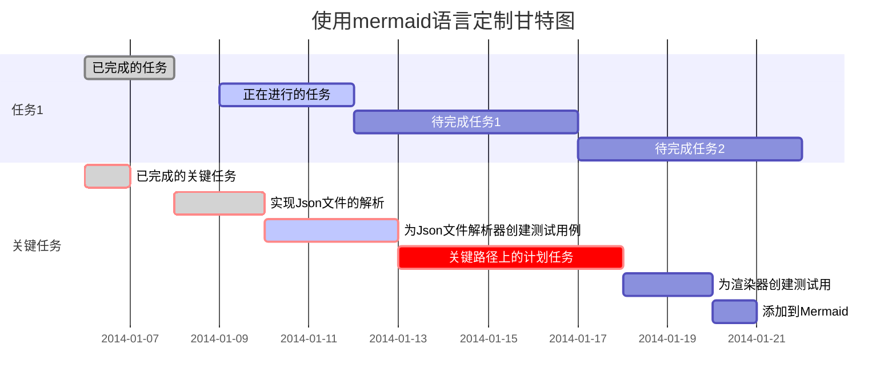

# 历史学习笔记

## 朝代

### 唐

### 辽 宋 夏 金 元

#### 帝王、官吏等

#### 事件

### 明

#### 帝王、官吏等

```mermaid
gantt
dateFormat YYYY-MM-DD
title 明朝人物

section 明朝帝王

section 明朝人物

section 外藩

```

##### 明太祖 朱元璋

##### 明惠帝 朱允炆

##### 明太宗/成祖 朱棣

##### 明仁宗 朱高炽

##### 明宣宗 朱瞻基

##### 明英宗 朱祁镇

##### 明代宗 朱祁钰

#### 事件

### 清

## 人物

### 李

#### 李牧

### 王

### 曾

#### 曾巩

### 张

#### 张之洞

### 章

#### 章惇

## 心得


--- --- ---
甘特图示例
