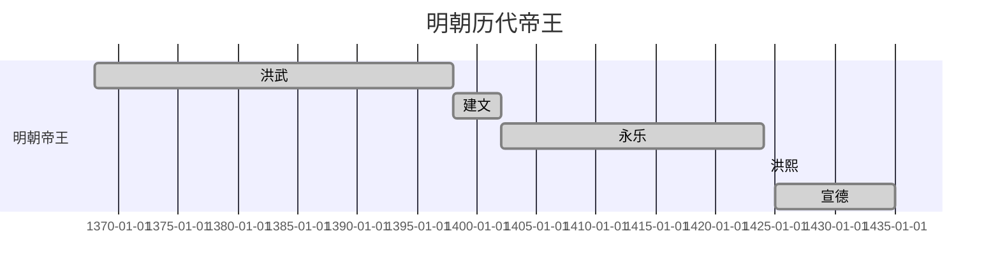
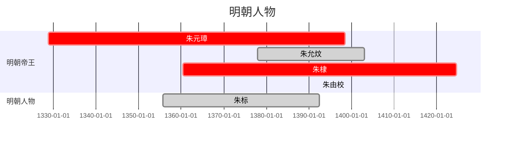

# 历史学习笔记

## 朝代

### 唐

### 辽 宋 夏 金 元

#### 帝王、官吏等

#### 事件

### 明

#### 帝王、官吏等

##### 明太祖 洪武 朱元璋

##### 明惠帝 建文 朱允炆

##### 明太宗/成祖 永乐 朱棣

##### 明仁宗 朱高炽

##### 明宣宗 朱瞻基

##### 明英宗 朱祁镇

##### 明代宗 朱祁钰

##### 明宪宗 朱见深

##### 明孝宗 朱祐樘

##### 明武宗 朱厚照

##### 明世宗 朱厚熜

##### 明穆宗 朱载坖

##### 明神宗 朱翊钧

##### 明光宗 朱常洛

##### 明熹宗 朱由校

##### 明思宗 朱由检

#### 事件

### 清

## 人物

### 李

#### 李牧

### 王

### 曾

#### 曾巩

### 张

#### 张之洞

### 章

#### 章惇

## 心得

--- --- ---
