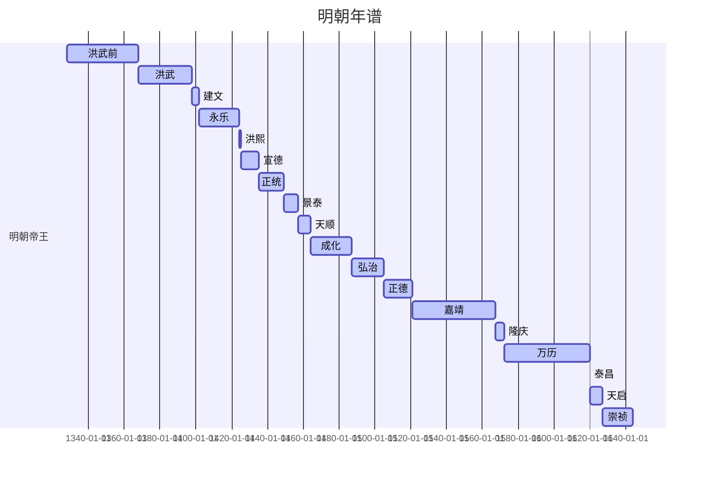
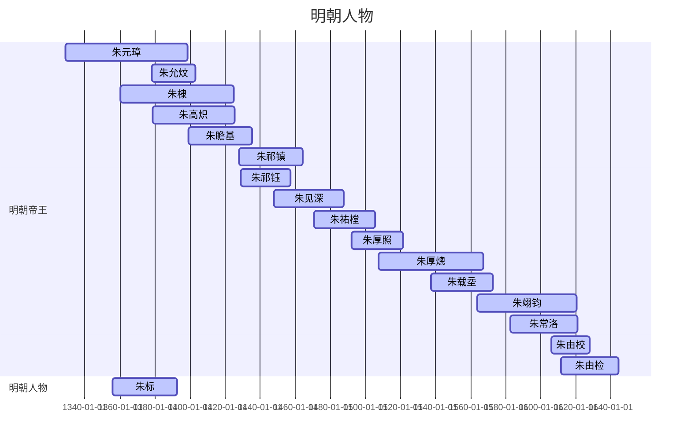
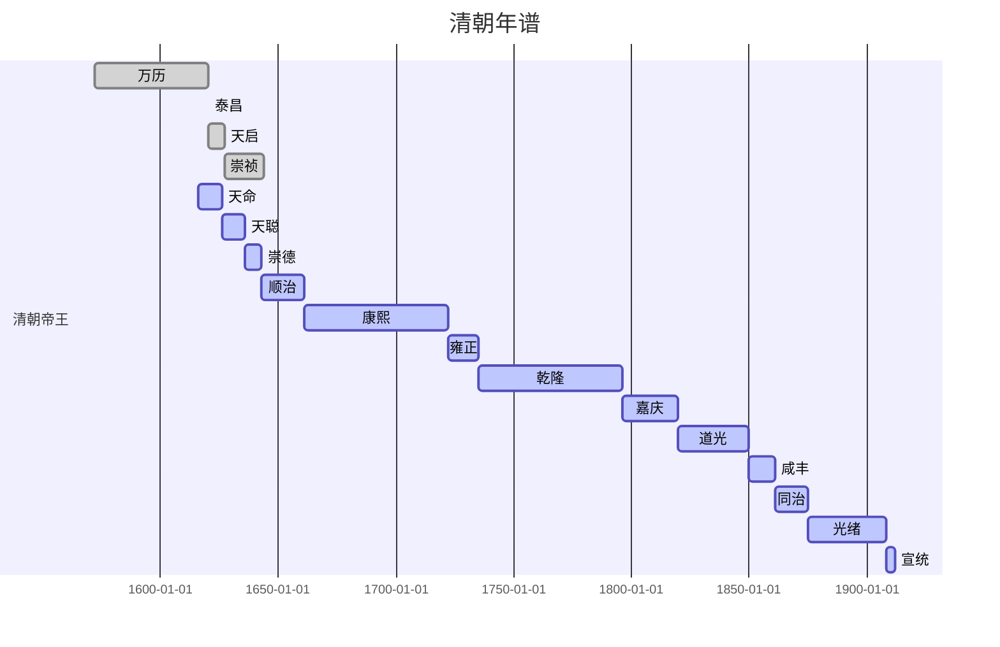
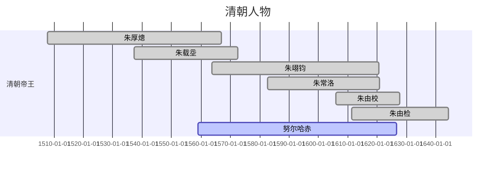

# 历史学习笔记

## 朝代

### 唐

### 辽 宋 夏 金 元

#### 帝王、官吏等

#### 事件

### 明

```mermaid
gantt
dateformat YYYY
title 明朝年谱

section 明朝帝王
洪武前: active, 朱元璋, 1328, 1368
洪武: active, 朱元璋, 1368, 1398
建文: active, 朱允炆, 1398, 1402
永乐: active, 朱棣, 1402, 1424
洪熙: active, 朱高炽, 1424, 1425
宣德: active, 朱瞻基, 1425, 1435
正统: active, 朱祁镇, 1435, 1449
景泰: active, 朱祁钰, 1449, 1457
天顺: active, 朱祁镇, 1457, 1464
成化: active, 朱见深, 1464, 1487
弘治: active, 朱祐樘, 1487, 1505
正德: active, 朱厚照, 1505, 1521
嘉靖: active, 朱厚熜, 1521, 1567
隆庆: active, 朱载坖, 1567, 1572
万历: active, 朱翊钧, 1572, 1620
泰昌: active, 朱常洛, 1620, 1620
天启: active, 朱由校, 1620, 1627
崇祯: active, 朱由检, 1627, 1644
```

#### 帝王、官吏

```mermaid
gantt
dateFormat YYYY-MM-DD
title 明朝人物

section 明朝帝王
朱元璋: active, , 1328-10-21, 1398-06-24
朱允炆: active, , 1377-12-05, 1402-12-31
朱棣: active, , 1360-05-02, 1424-08-12
朱高炽: active, 1378-08-16, 1425-05-29
朱瞻基: active, 1399-03-16, 1435-01-31
朱祁镇: active, 1427-11-29, 1464-02-23
朱祁钰: active, 1428-09-11, 1457-03-14
朱见深: active, 1447-12-09, 1487-09-09
朱祐樘: active, 1470-07-30, 1505-06-08
朱厚照: active, 1491-10-26, 1521-04-20
朱厚熜: active, 1507-09-16, 1567-01-23
朱载坖: active, 1537-03-04, 1572-07-05
朱翊钧: active, 1563-09-04, 1620-08-18
朱常洛: active, 1582-08-28, 1620-09-26
朱由校: active, 1605-12-23, 1627-09-30
朱由检: active, 1611-06-02, 1644-04-25

section 明朝人物
朱标: active, , 1355-10-10, 1392-05-17

section 外藩

```

##### 明太祖 朱元璋

##### 明惠帝 朱允炆

##### 明太宗/成祖 朱棣

##### 明仁宗 朱高炽

##### 明宣宗 朱瞻基

##### 明英宗 朱祁镇

##### 明代宗 朱祁钰

##### 明宪宗 朱见深

##### 明孝宗 朱祐樘

##### 明武宗 朱厚照

##### 明世宗 朱厚熜

##### 明穆宗 朱载坖

##### 明神宗 朱翊钧

##### 明光宗 朱常洛

##### 明熹宗 朱由校

##### 明思宗 朱由检

#### 事件

### 清

```mermaid
gantt
dateformat YYYY
title 清朝年谱

section 清朝帝王
万历: done, 朱翊钧, 1572, 1620
泰昌: done, 朱常洛, 1620, 1620
天启: done, 朱由校, 1620, 1627
崇祯: done, 朱由检, 1627, 1644
天命: active, 努尔哈赤, 1616, 1626
天聪: active, 皇太极, 1626, 1636
崇德: active, 皇太极, 1636, 1643
顺治: active, 福临, 1643, 1661
康熙: active, 玄烨, 1661, 1722
雍正: active, 胤禛, 1722, 1735
乾隆: active, 弘历, 1735, 1796
嘉庆: active, 颙琰, 1796, 1820
道光: active, 旻宁, 1820, 1850
咸丰: active, 奕詝, 1850, 1861
同治: active, 载淳, 1861, 1875
光绪: active, 载湉, 1875, 1908
宣统: active, 溥仪, 1908, 1912
```

#### 帝王、官吏

```mermaid
gantt
dateFormat YYYY-MM-DD
title 清朝人物

section 清朝帝王
朱厚熜: done, 1507-09-16, 1567-01-23
朱载坖: done, 1537-03-04, 1572-07-05
朱翊钧: done, 1563-09-04, 1620-08-18
朱常洛: done, 1582-08-28, 1620-09-26
朱由校: done, 1605-12-23, 1627-09-30
朱由检: done, 1611-06-02, 1644-04-25
努尔哈赤: active, 1559-01-15, 1626-09-30

section 清朝人物

section 外藩

```

##### 清太祖 ~·努尔哈赤

##### 清太宗 ~·皇太极

##### 清世祖 ~·福临

##### 清圣祖 ~·玄烨

##### 清世宗 ~·胤禛

##### 清高宗 ~·弘历

##### 清仁宗 ~·颙琰

##### 清宣宗 ~·旻宁

##### 清文宗 ~·奕詝

##### 清穆宗 ~·载淳

##### 清德宗 ~·载湉

##### 清逊帝 ~·溥仪

#### 事件

--- --- ---

## 人物

### 李

#### 李牧

### 王

### 岳

#### 岳飞

### 曾

#### 曾巩

### 张

#### 张之洞

### 章

#### 章惇

--- --- ---

## 心得

--- --- ---
